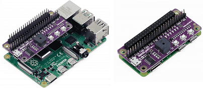

# rasp_maker_phat

[README en français](./FR_README.md)

### Que fait ce package ?
<details>
<summary>Le package <b>rasp_maker_phat</b> contient tous les modules Python nécessaires à la gestion de la carte chapeau <b>MAKER-pHAT</b>.<br>Cette carte est fabriquée par la société Cytron (https://www.cytron.io)</summary><br>
   
Exemple de montages sur modules Raspberry Pi 3B+ ou Pi Zero.<br><br>



</details>


### Caractéristiques de cette carte.
<details>
<summary>Cette carte est dotée de huit LED, d'un buzzer, de trois boutons-poussoirs et d'une interface USB UART.<br><br></summary>

>- Sa taille est la même que celle d'un module Raspberry Pi Zero. Il s'intègre parfaitement à la série de types Pi Zero SBC<br>
(SBC : ordinateur monocarte)<br>
>- Il est également compatible avec les tailles Raspberry Pi : <br>
> - Taille standard : 3B/3B+/4B1GB/4B2GB/4B4GB<br>
> - Taille moyenne : 3A+<br>
> - Petite taille : Pi Zero/W/WH..<br>
>- Son brochage est entièrement compatible avec le Bus GPIO des modules Raspberry.
>- Les 8 LEDs sont sélectionnables via les pins GPIO (17, 18, 27, 22, 25, 12, 13, 19) en mode BCM.<br>
>- Les trois boutons poussoirs sont programmables via les broches GPIO (21,19,20) en mode BCM. <br>
>- Le Buzzer peut être activé sur la broche (GPIO 26) en mode BCM.<br>
>- Les broches GPIO affectées à chaque fonctionnalité sont clairement identifiées (sérigraphiées) sur le circuit imprimé.<br>Y compris SPI, UART, I2C, 5V, 3.3V, et GND.<br>
>- Son entrée USB fait office d'entrée d'alimentation et de ports UART.
>- Sa tension d'entrée USB est de 5v. La source peut être un PC, une batterie externe ou un adaptateur secteur.<br>
     Il peut également être alimenté par le BUS 5V du module Raspberry Pi.

  <br><br>
**Pour plus d'informations, consulter le site du fabricant** [CyTRON](https://www.cytron.io/c-raspberry-pi-hat#/-c616/cytron-m11/sort=p.number_sales/order=DESC/limit=20/minPrice=/maxPrice=)<br><br>>


</details>

## Utilisation du package

Ce package contient trois modules décrits ci-dessous :
<br>**Remarque** : le nom des modules est préfixé par "**m_**" signifiant **module**.

<details>
<summary><b>Module : m_leds.</b> Il gère uniquement les 8 LED de la carte Maker-pHAT</summary><br>

> <details>
> <summary><b>Méthodes</b> :</summary><br>
>
>> <details>
>> <summary><b>flash( led_n , tempo = 1.0 )</b></summary><br>
>>
>>>- **BUT** : La LED identifiée par <b>led_n</b> s'allume, puis <b>tempo</b> secondes plus tard la LED s'etteind. <br><br>
>>>- **PARAMETRES** :
>>>    - **led_n** : indice des LED.
>>>       - **int** dans l'ensemble [0, 7]
>>>       - led_n = 0 correspond à la LED à l'extrême droite de la carte Maker-pHAT.
>>>       - led_n = 7 correspond à  la LED à l'extrême gauche de la carte Maker-pHAT.<br><br>
>>>    - **tempo** : Temps (en secondes) pendant lequel la Led d'indice **led_n** sera **allumée**. Passé ce délai, La led s'éteind.<br>
>>>       - float, ]0, oo[
>>>       - Par défaut **tempo** = 1,0 seconde<br><br>
>> </details>
>>
>> <details>
>> <summary><b>flash_mask(mask = 0xFF, tempo = 1.0)</b></summary><br>
>>
>>>- **BUT** : La ou les LED sélectionnées par le **mask** s'allument, puis une fois le tempo écoulée, les mêmes LED s'éteignent.<br><br>
>>>- **PARAMETRE** :
>>>    - **mask** : masque de 8 bits, chaque bit est associé à une LED.
>>>       - **int** dans l'ensemble [0x00, 0xFF]
>>>       - mask = 0x01 est associé à la LED située à l'extrême droite de la carte Maker-pHAT.
>>>       - mask = 0x80 est associé à la LED située à l'extrême gauche de la carte Maker-pHAT.
>>>       - mask = 0b01010101 = 0x55 est associé aux LEDS d'index {6, 4, 2, 0}
>>>       - mask = 0xFF est associé aux LEDS  d'index {7, 6, 5, 4, 3, 2, 1, 0}<br><br>
>>>    - **tempo** : Temps (en secondes) pendant lequel la ou les Led seront allumées. Passé ce délai, elles s'éteindront.<br>
>>>       - **float**, ]0, oo[
>>>       - Par défaut **tempo** = 1,0 seconde<br><br>
>> </details>
>>
>> <details>
>> <summary><b>set_on_leds(mask = 0x00)</b></summary><br>
>>
>>>- **BUT** : La ou les LED sélectionnées par le **mask** s'allument, et reste allumées.</br></br>
>>>- **PARAMETRE** :
>>>    - **mask** : masque de 8 bits, chaque bit est associé à une LED.
>>>       - **int** [0x00, 0xFF]
>>>       - mask = 0x01 est associé à la LED située à l'extrême droite de la carte Maker-pHAT.
>>>       - mask = 0x80 est associé à la LED située à l'extrême gauche de la carte Maker-pHAT.
>>>       - mask = 0b01010101 = 0x55 est associé aux LEDS d'index {6, 4, 2, 0}
>>>       - mask = 0xFF est associé aux LEDS d'index {7, 6, 5, 4, 3, 2, 1, 0}<br><br>
>>>       - **REMARQUE 1** : si masque = 0x00 alors l'état des 8 LED ne sera pas modifié.
>>>       - **REMARQUE 2** : si une LED sélectionnée par le masque est déjà allumée, alors elle reste allumée.<br>
>> </details>
>>
>> <details>
>> <summary><b>set_off_leds(mask = 0x00)</b></summary><br>
>>
>>>- **BUT** : La ou les LED sélectionnées par le **mask** s'éteignent, et reste éteintes</br></br>
>>>- **PARAMETRE** :
>>>    - **mask** : masque de 8 bits, chaque bit est associé à une LED.
>>>       - **int** [0x00, 0xFF]
>>>       - mask = 0x01 est associé à la LED située à l'extrême droite de la carte Maker-pHAT.
>>>       - mask = 0x80 est associé à la LED située à l'extrême gauche de la carte Maker-pHAT.
>>>       - mask = 0b01010101 = 0x55 est associé aux LEDS d'index {6, 4, 2, 0}
>>>       - mask = 0xFF est associé aux LEDS d'index {7, 6, 5, 4, 3, 2, 1, 0}<br><br>
>>>       - **REMARQUE 1** : si masque = 0x00 alors l'état des 8 LED ne sera pas modifié.
>>>       - **REMARQUE 2** : si une LED sélectionnée par le masque est déjà éteinte, alors elle reste éteinte<br>
>> </details>
>>
>> <details>
>> <summary><b>Exemple de code</b></summary><br>
>>
>>> ```python
>>> from rasp_maker_phat import m_leds
>>>
>>> # Instanciation
>>> leds = m_leds.Leds()
>>>
>>> # Allume la Led n°2 pendant une seconde (par défaut) puis l'éteind.
>>> leds.flash( 2 )
>>> # Allume la Led n°5 pendant 0,3 seconde puis l'éteind.
>>> leds.flash( 5, 0.3 )
>>>
>>> # Etteind toutes les LED, puis allume uniquement les LEDs d'index impair.
>>> leds.set_off_leds(x0FF)
>>> leds.set_on_leds(x055)
>>>
>>> # On commence par eteindre toutes les LEDs
>>> # Puis, on allume toutes les LEDs paires pendant  1,5 seconde
>>> # Puis, on allume toutes les LED impaires pendant  2,6 secondes
>>> leds.set_off_leds(x0FF)
>>> leds.flash_mask( x055, 1.5 )
>>> leds.flash_mask( x0AA, 2.6 )
>>> ```
>> </details>
>>
>> `_______________________________________________________________________________________________`
> </details>
</details>

<details>
<summary><b>Module : m_buttons.</b> Il gère uniquement les 3 boutons poussoirs (switch) de la carte Maker-pHAT.</summary><br>

> <details>
> <summary><b>Getters</b> :</summary>
> <br>
>
>>- **list_of_switch_pins**<br>
>> renvoie la liste des trois **pin_code BCM** associées aux 3 switchs.<br>
>>- **list_of_switch_names**<br>
>> renvoie la liste des trois **switch_name** qui sont sérigraphiés sur la carte maker-pHAT.<br>
>>- **dico_switch_name_to_pin_code**<br>
>> renvoie le dictionnaire des couples (switch_name, pin_code) où switch_name est la clé.<br>
>>- **dico_pin_code_to_switch_name**<br>
>> renvoie le dictionnaire des couples (pin_code, switch_name) où code_pin est la clé.<br>
> </details>
>
> <details>
> <summary><b>Méthodes</b> :</summary><br>
>
>> <details>
>> <summary><b>logical_state_pins (list_of_switch_name)</b> :</summary><br>
>>
>>>- **BUT**<br>
>>>    - L'état logique des switchs demandés dans le parametre d'entrée **liste_of_switch_name** est retouné.<br>
>>>    - Le résultat est sous la forme d'un dictionnaire de paires **<Clé, valeur>**.<br>
>>>        - **Key** est le nom du switch
>>>        - **valeur** est l'**état logique du pin_code** associée au switch.<br>
>>>        - Le dictionnaire contient autant de paires que de switch_name valides,et distincts contenus dans la liste d'entrée.<br><br>
>>>- **PARAMÈTRE**
>>>    - **list_of_switch_name** :
>>>        - Quels sont les types de données autorisés ou interdits pour le paramètre d'entrée.<br>
>>>           - SI c'est un **str** : Dans ce cas, un seul nom de switch est autorisé.<br>
>>>             Il s'agira alors soit de **"sw1"**, soit de **"sw2"**, soit de **"sw3"**..<br>
>>>           - SI c'est un **tuple** : **NON AUTORISÉ**.<br>
>>>           - SI c'est une **list** : Dans ce cas cette liste doit contenir un ou plusieurs switch_name parmi : <br>**"sw1"** et/ou **"sw2"** et/ou **"sw3"**.<br>
>>>             L'ordre n'a pas d'importance et la répétition accidentelle d'un nom n'a aucune conséquence..<br><br>
>>>    - exemples de syntaxe autorisée
>>> ``` python
>>> buttons = m_button.Button()
>>> buttons.logical_state_pins( "sw1" ) 
>>> buttons.logical_state_pins( "sw2" ) 
>>> buttons.logical_state_pins( ["sw3"] ) 
>>> buttons.logical_state_pins( ["sw1", "sw2", "sw3"] ) 
>>> ```
>>> - **Attention** : <br>
>>>    - Si le nom du switch ne figure pas parmi **"sw1"** ou **"sw2"** ou **"sw3"** Alors une **KeyError** sera levée.<br>
>>>      L'interception et le traitement de cette erreur relèvent de la responsabilité de l'utilisateur.<br><br>
>>>- **RETOUR**<br>
>>>    - L'état logique d'une pin sera représenté sous trois formes :
>>>        - str **"ON"** qui signifie *le switch est à l'état enfoncé*.<br>
>>>        - str **"OFF"** qui signifie *le switch est à l'état relâché*.<br>
>>>        - **None** ce qui signifie que *la pin associée au switch n'a pas été initialisé*, la requête n'a aucun sens.<br><br>
>>>    - exemples de retour<br>
>>> ``` python
>>> { "sw1": "ON" }
>>> { "sw2": None }
>>> { "sw3":"OFF" }
>>> { "sw1": "ON", "sw2": None, "sw3": "OFF" }
>>> ```
>>> - **Rappel** : <br>
>>>    - Soyez prudent lorsque vous utilisez cette méthode avec l'instruction print.<br>
>>>      N'oubliez pas d'alterner les guillemets doubles et les guillemets simples.<br>
>>> ``` python
>>> buttons = m_button.Button()
>>> print( f"les états sont { buttons.logical_state_pins( ['sw1', 'sw3'] ) } " ) # " ' ' " 
>>> print( f'les états sont { buttons.logical_state_pins( ["sw1", "sw3"] ) } ' ) # ' " " '
>>> ```   
>> </details>
>>
>> <details>
>> <summary><b>add_event_detect_switch (switch_name, trigger = GPIO.FALLING, callback = vide, temps de rebond = 50)</b> :</summary><br>
>>
>>>- **OBJECTIF**<br>
>>> Crée un thread qui surveille les actions effectuées sur le switch (**switch_name**) de la carte Maker-pHat.<br>
>>> L'action (**trigger**) consistera à appuyer ou à relâcher ou les deux.<br>
>>> Dès que l'action apparaît, le thread appellera la fonction (**callback**) qui traitera l'action sur le switch.<br><br>
>>>- **PARAMÈTRES**
>>> - **switch_name** : str dans l'ensemble "**sw1**", "**sw2**", "**sw3**" .<br>
>>> - C'est le nom du switch de la carte Maker-pHat qui sera surveillé par le thread.<br><br>
>>> - **trigger** : indique sur quel front du signal le traitement sera déclenché.
>>> - int seulement trois valeurs possibles [GPIO.FALLING (appuyer), GPIO.RISING (relâcher) , GPIO.BOTH (appuyer ou relâcher]
>>> - Toutes les actions sur un interrupteur déclencheront un traitement soit sur le front montant du signal, soit sur le front descendant, ou les deux.<br>
>>> Dans ce dernier cas le traitement sera déclenché deux fois.<br><br>
>>> - **callback** : ce paramètre est le nom de la fonction qui sera appelée par le thread pour traiter l'événement.<br>
>>> - Le nom par défaut est **empty**.<br>
>>> Où **empty** est une fonction interne à la classe, et cette fonction ne fait rien (pass).
>>> - Si vous ne redéfinissez pas le paramètre de rappel, un thread sera quand même créé.<br>
>>> Lorsqu'un événement se produit, la fonction **empty** sera appelée mais elle ne produira aucun effet.<br>
>>> - **Attention** :<br>
>>> Le nom de la fonction de traitement n'est pas une **str**.<br>
>>> Par conséquent, ce nom ne doit pas être écrit entre guillemets ou guillemets doubles, comme le sont généralement les str.
>>> <br><br>
>>> - **bouncetime** : temps nécessaire pour stabiliser l'état du switch.
>>> - int [0,oo[.<br>
>>> - L'unité est la milliseconde. Par défaut, sa valeur est fixée à 5O ms. <br>
>>> - **Réduire** cette valeur risque de rendre le traitement de l'évènement instable.<br>
>>> Il existe un risque que pour une même action le traitement soit ensuite lancé plusieurs fois de suite.<br>
>>> - **L'augmentation** de cette valeur retarde le traitement de l'action du switch.<br><br>
>> </details>
>>
>> <details>
>> <summary><b>cleanup (switch_names = None)</b> :</summary>
>> <br>
>>
>>>- **OBJECTIF**<br>
>>> - Le(s) switch(s) mentionné(s) dans le paramètre (switch_names) entraîneront :
>>> - La désactivation de chacune des pin (pin_code) associées à ces switchs.
>>> - Mise des pins dans un état électrique n'entraînant aucun risque de destruction de la carte Raspberry
>>> - Arrêter et détruire les threads concernés.
>>> - Après cette commande, toutes les actions sur les switchs concernés n'auront plus aucun effet..<br><br>
>>>- **PARAMETRE**<br>
>>> - **switch_name** : Plusieurs écritures et types sont possibles.<br><br>
>>> - Si ce paramètre n'est pas spécifié, alors sa valeur par défaut sera **None**<br>
>>> Dans ce cas, les trois switchs **sw1**", "**sw2**" et "**sw3**" seront purgéss.<br>
>>> Après cette commande, toute action sur les switchs de la carte Maker-pHAT n'aura aucun effet.<br><br>
>>> - str **sw1**" ou "**sw2**" ou "**sw3**". Un seul nom de switch à la fois sera purgé.<br><br>
>>> - La liste ou le tuple ne doit contenir que les termes **"sw1"** et/ou **"sw2"** et/ou **"sw3"**<br>
>>> **Remarque**<br>
>>> - Ecrire [ "sw1", "sw2", "sw3" ] équivaut à ne pas saisir de valeur pour ce paramètre (cas None).<br>
>>> - L'ordre des noms de switchs dans la liste n'a pas d'importance.<br>
>>> - Une répétition accidentelle du nom d'un switch n'a aucune conséquence.<br>
>>> À la première occurrence du nom du switch, il sera purgé.<br><br>
>> </details>
>>
>> <details>
>> <summary><b>Details sur l'écriture des fonctions de callback</b> :</summary>
>> <br>
>>
>>> <details>
>>> <summary><b>Combien de formats sont autorisés ? :</b> :</summary>
>>> <br>
>>>
>>>
>>>> ```python
>>>> # Premier format possible
>>>> # args est un tuple qui ne contient qu'un seul élément.
>>>> # Cet élément est le code BCM du code PIN à l'origine de l'événement, et **args[0]** est la valeur de ce code PIN.
>>>> def your_function_name(*args) :
>>>>     code_pin = arguments[0]
>>>>     votre code
>>>>
>>>> # Deuxième format possible
>>>> # pin_code est le code BCM du pin provoquant l'événement
>>>>     def your_function_name (pin_code) :
>>>>     votre code
>>>> ```
>>> </details>
>>>
>>> <details>
>>> <summary><b>Combien de fonctions callback devons-nous créer ? :</b> :</summary>
>>> <br>
>>>>
>>>> ```python
>>>> # PREMIÈRE POSSIBLE
>>>> # Une fonction par switch que vous souhaitez surveiller, par exemple sw1 et sw3
>>>> # Dans ce cas, le paramètre d'entrée n'a pas d'importance puisqu'il est connu à l'avance, mais
>>>> # le format de ce paramètre doit être indiqué même s'il ne sera pas utilisé dans votre code
>>>>
>>>> def name_of_your_SW1_callback_function ( format d'entrée choisi) :
>>>>     votre code pour traiter le switch sw1
>>>>
>>>> def name_of_your_SW3_callback_function ( format d'entrée choisi) :
>>>>     votre code pour traiter le switch sw3
>>>> #---------------------------------------------- ---------------
>>>>
>>>> # DEUXIÈME POSSIBILITÉ
>>>> # Une seule fonction commune à tous les interrupteurs.
>>>> # C'est votre code qui adaptera le traitement en fonction du paramètre de saisie, quel que soit son format
>>>> def name_of_your_COMMON_callback_function(pin_code) :
>>>>     si pin_code == PIN_CODE_SW1 :
>>>>         votre code pour le switch sw1
>>>>
>>>>     elif pin_code == PIN_CODE_SW2 :
>>>>         votre code pour le switch sw2
>>>>
>>>>     elif pin_code == PIN_CODE_SW3 :
>>>>         votre code pour le switch sw3
>>>>
>>>>     else:
>>>>         votre code pour Erreur (normalement ce cas est impossible)
>>>> ```
>>> </details>
>>>
>>> <details>
>>> <summary><b>Comment traiter les événements dans le cas où trigger == GPIO.BOTH ? :</b> :</summary>
>>> <br>
>>>
>>>> Vous n'obtiendrez aucune information sur l'action sur le switch.<br>
>>>> S'agit-il d'une pression ou d'un relâchement de l'interrupteur ? Impossible de le savoir.<br>
>>>> Le paramètre d'entrée de votre fonction de rappel ne contiendra pas cette information, il contiendra uniquement le code PIN.
>>>> <br>
>>>>
>>>> ```python
>>>>
>>>> # CAS LE PLUS SIMPLE
>>>> # Peu importe que le déclenchement de l'appel soit dû à une action d'appui ou de relâchement sur l'interrupteur.
>>>> # Par exemple sur le switch sw1, et quel que soit le type d'événement déclencheur
>>>>
>>>> def name_of_your_BOTH_callback_function_on_SW1 (chosen_parameter_format) :
>>>> x.votre code pour le switch sw1
>>>>
>>>> #---------------------------------------------- ---------------
>>>>
>>>>
>>>>
>>>> # CAS UN LÉGÈREMENT MOINS SIMPLE
>>>> # En fonction de l'état logique du switch vous sélectionnez le traitement prévu pour le type d'événement approprié
>>>>
>>>> def name_of_your_BOTH_callback_function_on_SW1 (chosen_parameter_format) :
>>>> si x.logical_state_pins( 'sw1' ) == "ON" :
>>>> x.votre code pour l'interrupteur sw1 sur front DESCENDANT
>>>>
>>>> elif x.logical_state_pins( 'sw1' ) == "OFF" :
>>>> x.votre code pour switch sw1 sur front MONTANT
>>>>
>>>> else : # Aucun cas mais c'est impossible
>>>> réussir
>>>>
>>>> #---------------------------------------------- ---------------
>>>>
>>>>
>>>>
>>>> # CAS PLUS COMPLEXE
>>>> # Vous devez utiliser deux fonctions de rappel
>>>> # -- Un pour l'action d'appuyer sur l'interrupteur.
>>>> # -- Un autre lorsque l'action disparaît.
>>>> # Le principe est que chaque fonction de rappel se désactive et active la fonction de rappel opposée.
>>>> # Ce sont deux fonctions miroir
>>>> #
>>>> # Exemple pour le switch sw3 (inst_button)
>>>>
>>>> inst_buttons = boutons.Boutons()
>>>>
>>>> def name_of_your_FALLING_callback_function_SW3(pin_code) :
>>>> # vous désactivez la fonction de rappel traitant le déclencheur FALLING, et activez la fonction de rappel traitant le déclencheur RISING
>>>> # La classe Buttons vous permet de faire cela en une seule commande
>>>> inst_buttons.add_event_detect_switch( "sw3", GPIO.RISING, nom_de_votre_RISING_callback_function_SW3)
>>>>
>>>> # votre code spécifique pour l'événement FALLING commence ici
>>>> votre code....
>>>>
>>>>
>>>> def name_of_your_RISING_callback_function_SW3(pin_code) :
>>>> # vous désactivez la fonction de rappel traitant le déclencheur RISING, et activez la fonction de rappel traitant le déclencheur FALLING
>>>> # La classe Buttons vous permet de faire cela en une seule commande
>>>> inst_buttons.add_event_detect_switch( "sw3", GPIO.FALLING, nom_de_votre_FALLING_callback_function_SW3)
>>>>
>>>> # votre code spécifique pour l'événement RISING commence ici
>>>> votre code....
>>>> ```
>>>> </details>
>>>>
>>> </details>
>>>
>>> <details>
>>> <summary><b>Exemple de code</b></summary>
>>> <br>
>>>
>>>> ```python
>>>> mais = Boutons()
>>>>
>>>> # Déclaration des fonctions de traitement d'événements (fonction de rappel)
>>>> def test_button_sw1(*args) :
>>>> print(f"ici traitement sw1, args : {args}" )
>>>>
>>>> def test_button_sw2(*args) :
>>>> print(f"ici traitement sw2, args[0] : {args[0]}" )
>>>>
>>>> def test_button_sw3(pin_code) :
>>>> print(f"ici traitement sw3, pin_code : {pin_code}" )
>>>>
>>>> def common_test_button_switch(pin_code) :
>>>> print(f"Traitement COMMON : Événement sur pin_code {pin_code}")
>>>>
>>>> déf Rising_event_detected_on_sw1 (pin_code) :
>>>> buts.add_event_detect_switch("sw1", GPIO.FALLING, tombant_event_detected_on_sw1)
>>>> print(f"States : {buts.logical_state_pins('sw1')}")
>>>> print(f"rising_event : pin {pin_code}" )
>>>>
>>>> def falling_event_detected_on_sw1(pin_code ):
>>>> buts.add_event_detect_switch("sw1", GPIO.RISING,ising_event_detected_on_sw1)
>>>> print(f"States : {buts.logical_state_pins('sw1')}")
>>>> print(f"falling_event : pin {pin_code}" )
>>>>
>>>>
>>>>
>>>>    # Assignment of treads monitoring events occurring on each switch
>>>>    # Each switch has its own callback function.
>>>>    buts.add_event_detect_switch("sw1", GPIO.FALLING, test_button_sw1)
>>>>    buts.add_event_detect_switch("sw2", GPIO.RISING , test_button_sw2)
>>>>    buts.add_event_detect_switch("sw3", GPIO.BOTH   , test_button_sw3)
>>>>
>>>>
>>>>    print("\nYou can now push the button to test them FALLING, RISING, BOTH" )
>>>>    time.sleep(7)
>>>>
>>>>    # Reassign threads monitoring events occurring on each switch
>>>>    # All switches have the same callback function.
>>>>    buts.add_event_detect_switch("sw1", GPIO.FALLING, common_test_button_switch)
>>>>    buts.add_event_detect_switch("sw2", GPIO.RISING , common_test_button_switch)
>>>>    buts.add_event_detect_switch("sw3", GPIO.BOTH   , common_test_button_switch)
>>>>    print("\nYou can now push the button to test them with the same callback function")
>>>>    time.sleep(7)
>>>>
>>>>    # Now we deactivate all switches
>>>>    print("\nCleanup all switch. Now no more reaction from the switches")
>>>>    print(f"states befor cleanup : {buts.logical_state_pins(buts.list_of_switch_names)}")
>>>>    buts.cleanup(  )
>>>>    print(f"states after cleanup : {buts.logical_state_pins(buts.list_of_switch_names)}")
>>>>    time.sleep(4)
>>>>
>>>>    # Only callback function of sw1 is activated t_detect_switch/
>>>>    print("\nOnly switch SW1 is re-activated. with BOTH trigger. The callback function will be twice callet. Test  it" )
>>>>    print(f"States befor add_event_detect_switch : {buts.logical_state_pins(buts.list_of_switch_names)}")
>>>>    buts.add_event_detect_switch("sw1", GPIO.BOTH, test_button_sw1)
>>>>    print(f"States after add_event_detect_switch : {buts.logical_state_pins(buts.list_of_switch_names)}")
>>>>    time.sleep(4)
>>>>
>>>>    # To detect front up and front down
>>>>    buts.add_event_detect_switch("sw1", GPIO.FALLING, falling_event_detected_on_sw1)
>>>>    print("\nFinally we simulate the BOTH trigger with two callback functions on the sw1")
>>>>    time.sleep(7)
>>>>    print()
>>>>
>>>>  ```
>>>  </details>
>>>
>>>`_______________________________________________________________________________`
>>  </details>
>
>  </details>

<details>   
<summary><b>Module  : m_buzzer.</b> It is responsible for managing the unique buzzer of the Maker-pHAT card</summary><br>
   
>  <details>
>  <summary><b>Methodes</b> :</summary><br> 
>
>>  <details>
>>  <summary><b>beep (beep_duration = 1.0)</b> :</summary><br>
>>
>>>-  **AIM** :  For a time expressed in seconds, the buzzer emits a sound.<br><br>
>>>-  **PARAMETERS**
>>>      -  **beep_duration** : float in ]0, oo[.<br>
>>>      -  Unit seconds
>>>      -  Default value 1 second.
>>  </details> 
>>
>>  <details>
>>  <summary><b>beep_repeat (number_cycles = 2, beep_duration = 1.0, noiseless_duration = 1.0 )</b> :</summary><br>
>>
>>>-  **AIM**<br>
>>>     Buzzer beeps number_cycles times, and a cycle starts with a beep.<br>
>>> Le buzzer émet un son pendant beep_duration secondes et reste silencieux pendant noiseless_duration secondes à chaque cycle.<br><br>
>>>- **PARAMÈTRES**
>>> - **number_cycles** : Nombre de répétitions de cycle (bip-silencieux).<br>
>>> - int dans [2, 3, .. oo[.<br>
>>> - Exprimé en secondes <br>
>>> - Valeur par défaut 2.<br><br>
>>> - **beep_duration** : Temps pendant lequel le buzzer émet un son.<br>
>>> - flotte dans ]0, oo[.<br>
>>> - Exprimé en secondes.<br>
>>> - Valeur par défaut 1,0 seconde.<br><br>
>>> - **noiseless_duration** : Temps pendant lequel le buzzer reste silencieux.<br>
>>> - flotte dans ]0, oo[.<br>
>>> - Exprimé en secondes <br>
>>> - Valeur par défaut 1,0 seconde.<br><br>
>> </details>
>>
>> <details>
>> <summary><b>Exemple de code</b> :</summary><br>
>>
>>> ```python
>>> depuis rasp_maker_phat importer m_buzzer en tant que mb
>>>
>>>
>>> #créer l'obj buz à partir de la classe Buzzer
>>> buz = mb.Buzzer()
>>>
>>> # Buzzer allumé pendant une seconde (par défaut)
>>> buz.beep()
>>> time.sleep(1) # Faites une pause avant d'essayer une autre valeur de temps de bip
>>>
>>> # Buzzer allumé pendant 0,2 seconde
>>> buz.bip(0.2)
>>> time.sleep(1) # Pause avant d'essayer un cycle
>>>
>>> # Fonctionnement cyclique du buzzer
>>> # Cycle : ON pendant 0,1 seconde et OFF pendant 0,2 seconde.
>>> # Ce cycle est répété 5 fois
>>> buz.beep_repeat(5, 0.1, 0.2)
>>> ```
>>>
>>>`_______________________________________________________________________________________________`
>> </details>
> </details>
</details>
 
## Contribution
Les demandes de tirage sont les bienvenues.<br>
Pour les changements majeurs, veuillez d'abord poser une question pour discuter de ce que vous souhaitez modifier.<br>
Assurez-vous de mettre à jour les tests le cas échéant.<br>

## Licence

[MIT](https://choosealicense.com/licenses/mit/

